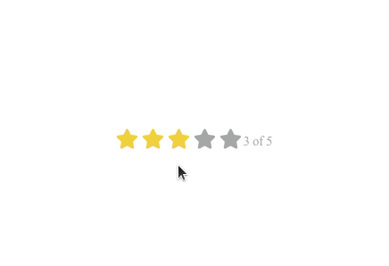

### Vue.js fontawesome icon rate component

It's easy to use Vue.js component for star rating!

1. This package is fully customized (Shape, Color, Rate, ...).
2. I used [Vue font awesome][1].
3. You can change your rating shape with free and open source font awesome project.
---


### Install package

1. Install with npm `npm i vue-js-star-rating --save`
2. Install with yarn `yarn add vue-js-star-rating --save`

### Code sample

After import and registering component in your Vue.js application:

```vue
<template>
  <div>
    <vue-star-rate
      :rateRange="3"
      :maxIcon="5"
      :iconHeight="22"
      :iconWidth="22"
      :hasCounter="true"
      iconColor="#FFFF99"
      iconColorHover="#FFFF99"
      iconShape="star"
    ></vue-star-rate>
  </div>
</template>

<script>
import vueStarRate from "vue-js-star-rating";
export default {
  components: { vueStarRate }
};
</script>

```

## Documents

| Attribute      |             Description             |    Type | Default |
| -------------- | :---------------------------------: | ------: | ------- |
| rateRange      |        Number of active icon        |  Number | 3       |
| maxIcon        |           Number of icons           |  Number | 5       |
| iconHeight     |             Icon height             |  Number | 45      |
| iconWidth      |             Icon width              |  Number | 45      |
| hasCounter     |         Counter like 3 of 5         | Boolean | true    |
| iconColor      |            Color of icon            |  String | #f3d23e |
| iconColorHover |         Color of hover icon         |  String | #f3d23e |
| iconShape      | Shape of icon like star, heart, etc |  String | star    |
| ratingSet      |      Event after click on icon      |   Event | null    |

[1]: https://www.npmjs.com/package/vue-awesome

### Events

When a star is clicked, an event is emitted called `ratingSet`. You can listen for
this event to get the value of the rating.

```vue
<template>
  <div>
    <vue-star-rate v-on:ratingSet="myRatingMethod"></vue-star-rate>
  </div>
</template>

<script>
import vueStarRate from "vue-js-star-rating";
export default {
  components: { vueStarRate },
  methods: {
    myRatingMethod(rating) {
      console.log("The selected rating is " + rating);
    }
  }
};
</script>

```
